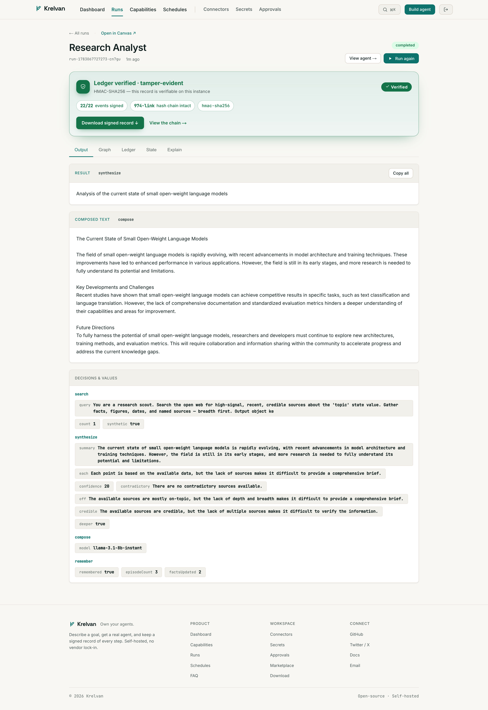

<div align="center">

# Krelvan

### Own and run your own AI agents.

**Describe a goal in plain English. Krelvan builds a real agent that researches, drafts, and
acts across your tools, runs it, and delivers the result to your inbox or channels — self-hosted,
on your machine, yours to keep.**

`The canvas is the runtime` · Self-hostable · Apache-2.0 · Zero runtime deps in core

</div>

---

<div align="center">

_Watch an agent run live — each step lights up on the canvas as it executes._


_A real Research Analyst run — every step recorded, so you can replay exactly what happened._



_The agent canvas maps 1:1 to what executed — nodes are real steps, the dashed arc is a real retry loop._


</div>

---

## Why Krelvan

Every AI-agent platform can *describe* what an agent will do. Krelvan actually **does the work** —
and lets you see, replay, and control every step.

Every run is recorded as a real, ordered history of events. The visual canvas, the run timeline,
and the history are all *reads* of that one record — so **"what you see is exactly what executed"
is structural, not hopeful.** That single design choice is the difference between a workflow
runner and a platform you can hand to a customer or a security review.

On top of that, Krelvan does things only an agentic platform can:

- 🧠 **Builds agents from natural language** — describe an outcome, get a real, validated agent graph.
- 🔍 **Failure-reasoning** — when a run fails, Krelvan reasons over the full run history to find the *root cause*, the failing step, and a concrete fix.
- ♻️ **Auto-retry-with-fix** — it rebuilds a *corrected* agent from that diagnosis and re-runs it. (In our tests: a failed run was diagnosed, fixed, re-run, and **completed**.)
- 🧩 **A marketplace of capabilities AND whole agents** — install a tool (HTTP API, MCP server) or a complete **agent template** (graph + its capabilities + the secrets it needs) from a Git-based registry, in one click. Every capability is labelled with exactly what it can touch and when it pauses for your approval.
- 📦 **Ready-made agents** — a **Price Monitor** (watch a page, alert only when the price changes, on a schedule) and a **RAG Support Bot** (answer grounded only in your docs, cite the source, refuse when it doesn't know) — installable in one click.
- 🔎 **RAG, built in** — `rag.ingest` + `rag.search` over a local vector store, with embeddings from OpenAI, Gemini, or **Ollama (offline, no key)**.
- 🔌 **7 LLM providers** — Anthropic, OpenAI, Gemini, Groq, Mistral, Ollama (local), or any OpenAI-compatible gateway.

---

## Run it

The web UI and API boot with **no secrets**. LLM features (building agents, explanations,
diagnosis) switch on when you add a provider key.

**Clone and run (needs Node 22+):**

```bash
# check your Node version first:  node -v   (must be 22+)
git clone https://github.com/sreenathmmenon/krelvan
cd krelvan
npm install
npx krelvan          # run INSIDE the cloned repo — builds core + web, then starts both
```

The first run builds the web UI (~2–3 minutes, one time only). After that, starts take seconds.

```
Web UI   http://localhost:3100
API      http://localhost:3201/api/health
```

`Ctrl-C` stops both. Ports: `PORT` (API, default 3201) · `KRELVAN_WEB_PORT` (web, default 3100).

**Or, fully isolated (no Node toolchain needed) — Docker:**

```bash
docker compose up --build
```

Same URLs. The SQLite database persists in the named volume `krelvan-data`, so your agents
and runs survive restarts.

> **Note:** `npx krelvan` runs from inside the cloned repository (it invokes the project's own
> launcher). Krelvan is not published to npm yet — clone the repo to run it.

**Enable LLM features:** copy `.env.example` → `.env` and set a provider + key:

```bash
KRELVAN_LLM_PROVIDER=anthropic
KRELVAN_LLM_MODEL=claude-sonnet-4-6
KRELVAN_LLM_API_KEY=sk-ant-...
```

Or go local with **no key**: `KRELVAN_LLM_PROVIDER=ollama` · `KRELVAN_LLM_MODEL=llama3.2`.
Without any provider the UI still runs and clearly reports LLM as off.

---

## Self-hosting safely

Krelvan is safe by default and stays that way as long as you keep these in mind:

- **It binds to your machine only (`127.0.0.1`) by default.** Nothing is on the network unless you
  choose to expose it — exposing is a deliberate act (set `KRELVAN_WEB_HOST=0.0.0.0` for the web,
  `KRELVAN_HOST=0.0.0.0` for the API).

- **Exposing it? Put it behind HTTPS.** The app speaks plain HTTP; run it behind a reverse proxy
  (Caddy or nginx) that terminates TLS, then set `KRELVAN_SECURE_COOKIES=1` and
  `KRELVAN_WEB_ORIGIN=https://your-host`. Over HTTPS the session cookie is automatically a Secure
  `__Host-` cookie. The API refuses to start exposed without an auth token, so you can't open it to
  the world by accident.

- **Third-party TypeScript/JS plugins are trusted-code-only.** Declarative **YAML** capabilities and
  **MCP** connectors are safe to install from anyone — they can't run arbitrary code. A raw TypeScript
  plugin, however, runs real code (in a sandbox that denies file writes, subprocess spawning, and reads
  outside its own directory, and routes network through a brokered egress channel) — treat it like code
  you'd `npm install`: only install TS plugins you trust. Enabling one requires an explicit
  `KRELVAN_ALLOW_UNTRUSTED_PLUGINS=1`.

- **Your secrets are encrypted at rest** (AES-256-GCM) in the data directory. For backups, you can keep
  the encryption key separate from the ciphertext — see *Backups & the data directory* below.

---

## The one principle

**The canvas IS the runtime.** Execution is captured as a real, ordered record. The canvas, the run timeline, and the history
are all pure *reads* of that record. There is no separate "what happened" store that can
drift from "what ran" — they are the same thing.

---

## What's inside

### For the person using it
- **Describe → build → run** an agent from one sentence, with the plan shown before anything executes.
- **Full run records** — open any run and replay every step, decision, and output.
- **Failure-reasoning + retry-with-fix** — runs that fail get diagnosed and corrected, automatically.

### For companies building on it — "the value isn't features, it's eliminated decisions"
The hard infrastructure is solved so you only build domain logic:

| Solved for you | What it means |
|---|---|
| **Memory** | Episodic + semantic + trust-aware, with provenance — right by default. |
| **Human-in-the-loop** | Standard pause / approve / resume via an autonomy gradient (suggest · act-with-veto · full). |
| **Full history by default** | Every decision, tool call, and step recorded, so you can replay any run. |
| **Capabilities & trust** | Deny-by-default admission; capabilities declare a side-effect class and gate for approval; the supervisor co-signs results (plugins never self-sign). Declarative (YAML) + MCP capabilities are safe by construction. Untrusted TypeScript plugins run in a **real OS-process sandbox** (`node --permission`: fs-write / child_process / native-addons / worker / WASI denied, memory + timeout caps, scrubbed env) and reach the network **only through a brokered, allowlisted, SSRF-guarded egress channel** — secrets are injected at the destination on the host and never enter the plugin. Adversarially tested. |
| **Agent coordination** | Sub-agent delegation with supervisor co-sign. |
| **Failure-reasoning** | Reason about *why* a run failed and how to fix it — not just retry. |
| **Capability ecosystem** | Install a connector; it works in any agent. |

Ship agentic solutions for clients in days, not months.

### The marketplace (a Git repo, not a hosted site)
The "Discover" tab loads a registry `index.json` from a Git repo — an open, PR-based
model anyone can publish to. Entries are real and installable:

- **YAML capabilities** — wrap any HTTP API (no code).
- **MCP connectors** — connect GitHub, Slack, a filesystem, or any MCP server; every tool it exposes becomes a capability.
- **Agent templates** — a whole pre-built agent (its manifest + the capabilities it needs). One click installs the capabilities, creates the agent, and tells you which secrets to set. Ships with **Price Monitor**, **RAG Support Bot**, and **Knowledge Base Ingest**.
- **Deploy capabilities** — ship a site/app to **Vercel, Netlify, Cloudflare Pages, Render, or Railway** via the provider's deploy hook. These are `write-irreversible`, so an agent pauses for your approval before it ships.
- **Free + paid** — paid entries carry pricing + a license link; the platform never touches the money.

### Proven end-to-end

These flagship agents were run to completion through a real LLM provider (Groq,
`llama-3.1-8b-instant`) — each finished with a complete, replayable run record:

| Agent | Outcome | Record |
|---|---|---|
| **Research Analyst** | search → synthesise → compose a briefing | ✓ 22/22 steps recorded |
| **Price Monitor** | fetch a page, detect a change vs last run | ✓ 22/22 steps recorded |
| **Personal Advisor** | grounded advice weighed against your stored goals | ✓ 17/17 steps recorded |
| **Support Resolution Agent** | triage → retrieve → judge → **pause for your approval** before sending | ✓ 23/23 steps recorded |

Every provider (Anthropic / OpenAI / Groq / Mistral / Gemini / Ollama / any
OpenAI-compatible gateway) goes through one client with graceful structured-output
fallback, so a model that lacks `json_schema` still produces reliable output.

Authoring guide: [`docs/CAPABILITY_AUTHORING.md`](docs/CAPABILITY_AUTHORING.md). Every PR to the
registry runs a validator ([`registry/validate.test.ts`](registry/validate.test.ts)) — the same pure
validators the runtime uses — so a broken capability or template can't reach the Discover tab.

The default registry is the official one:
[`sreenathmmenon/krelvan-registry`](https://github.com/sreenathmmenon/krelvan-registry).
Point an install at your own fork with
`NEXT_PUBLIC_KRELVAN_REGISTRY_URL=https://raw.githubusercontent.com/<you>/krelvan-registry/main/index.json`
(see [`registry/`](registry/) for the format and the seed catalog).

---

## Architecture — 3 strict layers

1. **UI** — Next.js 15 web app: NL builder, interactive agent canvas (pan/zoom/replay), runs, capabilities marketplace, MCP, approvals, schedules.
2. **API + Runtime** — `node:http` server + the pure kernel / impure engine + the capability plane + the NL→manifest compiler.
3. **Persistence** — SQLite ledger (via `node:sqlite`), zero third-party runtime deps in core.

### Core invariants (every change respects these)
1. **The recorded run is the only source of truth** — everything else is a pure read of it.
2. **The kernel is pure; the engine is the only thing that touches the world.**
3. **No `eval`, ever** — conditional logic is a restricted, total typed-AST evaluator.
4. **Deny-by-default** — an ungranted capability never runs.
5. **Plugins are untrusted** — the supervisor co-signs what it observed; secrets never reach plugins (a broker mints scoped tokens).
6. **Crash-safe by construction** — state lives only in the log; resume = re-fold; effects run exactly once.
7. **Zero third-party runtime deps in core** — Node built-ins only, license-clean, small to self-host.

| Layer | Where | Proven by |
|---|---|---|
| **Run store** | `src/core/ledger/` | append-only event store, ordered and content-addressed, crash-safe CAS append (no forks), `verify()` catches any corruption or gap |
| **Manifest + safe expr** | `src/core/manifest/` | structural validation; conditional edges are a typed AST — never `eval` |
| **Capability plane** | `src/core/capability/` | deny-by-default, autonomy gradient, supervisor co-sign |
| **Pure kernel + engine** | `src/core/kernel/` | pure `decide()`; 3-event effect protocol; crash-hole HALT; resume |
| **Memory** | `src/core/memory/` | episodic/semantic planes, provenance, untrusted-inbound quarantine |
| **Compiler** | NL → validated manifest, with capability monotonicity (prompt injection can't escalate) |

---

## Try it yourself

```bash
npm install
npm run typecheck    # strict TS, clean
npm test             # 297 / 300 pass (3 are live-model API tests that need a key)
npm run demo:ledger  # canvas + timeline all read from one recorded run
npm run demo:resume  # kill mid-run, resume — each irreversible effect runs EXACTLY once
npm run demo:e2e     # a real 3-agent pipeline drives itself off its recorded run
npm run demo:compile # intent → compiled manifest → run; untrusted principal rejected
npm run demo:live    # (needs KRELVAN_ANTHROPIC_KEY) a real model proposes a workflow,
                     # the compiler validates it within authority, the engine runs it
```

---

## Status — honest

**Built & verified** (typecheck clean · 297/300 tests · web build green):
- Event-sourced run store + SQLite durable store (real on-disk crash/resume)
- Identity, secrets & time (key rotation/revocation, secret broker, monotonic clock)
- Capability plane (deny-by-default, autonomy gradient, supervisor co-sign)
- Manifest + safe expressions (typed AST, never eval)
- Pure kernel + engine (3-event effect protocol, crash-hole HALT, resume)
- NL→manifest compiler (capability monotonicity)
- Memory (multi-plane, provenance, untrusted-inbound gate)
- **Full web UI** — NL builder, agent canvas, runs, capabilities marketplace, MCP, approvals, schedules
- **Capabilities marketplace** — Git-registry-backed (live at [`krelvan-registry`](https://github.com/sreenathmmenon/krelvan-registry)), view/edit YAML source online, MCP connectors
- **Deploy capabilities** — Vercel / Netlify / Cloudflare Pages / Render / Railway, gated as write-irreversible
- **Failure-reasoning + auto-retry-with-fix** — diagnose a failed run from its full history, rebuild a corrected agent, re-run
- **7 LLM providers** behind one client (Anthropic/OpenAI/Gemini/Groq/Mistral/Ollama/OpenAI-compatible)

**Every run is fully recorded and replayable.** A run's state lives entirely in its recorded
history, so you can open any run and scrub back through it step by step — exactly what the agent
read, decided, and did — and export the whole record as a portable file. Because state lives in
that record, a run that crashes mid-flight resumes safely, and irreversible effects (sending an
email, calling a paid API) run exactly once, never twice.

## Backups & the data directory

Everything Krelvan persists lives in one place (`KRELVAN_DATA_DIR`, default `./data`). **Back it up
as a unit** — several files are unrecoverable if lost:

| File | What it holds | If lost |
| --- | --- | --- |
| `ledger.db` (+ `-wal`, `-shm`) | the run history — every run | the history is gone |
| `secret.key` | AES-256-GCM key for the secret store | **all stored secrets + in-app model config decrypt to nothing** |
| `signing-{owner,supervisor}.key` or `signing-*-ed25519.{key,pub}` | internal signing keys | **existing runs can no longer be checked for integrity** |
| `*.json`, `admin.auth`, `launcher.token` | agents/runs/registries, the admin credential, the launcher token | re-provision |

Snapshot the whole directory atomically (stop the process or use a consistent volume snapshot).
Do **not** back up `ledger.db` alone — without `secret.key` and the signing keys it is unusable.

**Not yet built:** PostgreSQL multi-tenant store adapter; asymmetric *publisher* signing for
third-party marketplace trust. Tracked in `docs/PREMORTEM.md`.

---

## Docs

- [`AGENTS.md`](AGENTS.md) — engineering rules & architecture (read before contributing)
- [`docs/AGENTIC_CAPABILITIES.md`](docs/AGENTIC_CAPABILITIES.md) — researched catalog of genuinely-agentic capabilities + roadmap
- [`docs/LEDGER_SPEC.md`](docs/LEDGER_SPEC.md) — the ledger contract & invariants
- [`docs/PREMORTEM.md`](docs/PREMORTEM.md) — enumerated failure modes, each with a guard + status
- [`registry/`](registry/) — the capability marketplace registry (format + seed)

## License

Apache-2.0. Self-host it, run it for yourself / your team / your clients, extend it, and
build paid or free solutions on top — you own what you build.
